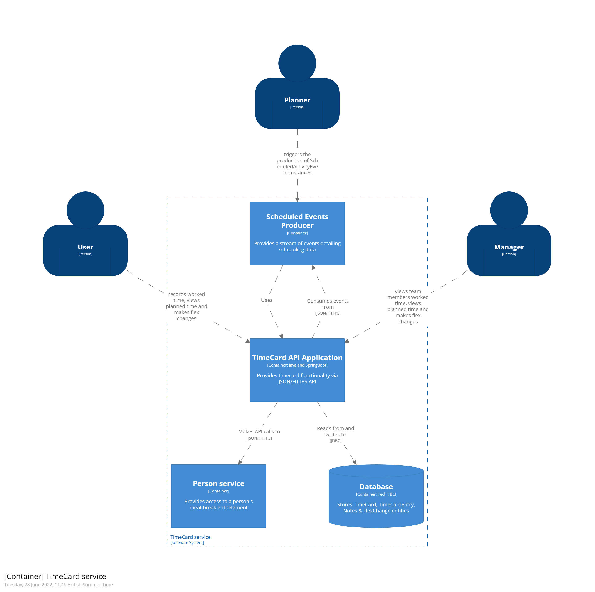

# TimeCard container

## Executive summary

The TimeCard container allows a person to record time that they have worked. This is sometimes known as booking time. It also allows that person to see what hours they have been scheduled to work. In addition, the container allows a manager to view and approve timecard entries for members of their team. Finally, the TimeCard container allow a person and their manager to make changes to scheduled time which are known as flexible (or flex) changes. 

In order to present a person with their scheduled hours, the TimeCard container consumes ScheduledActivityEvent events produced by the Scheduler Container.  

Internally the TimeCard container maintains a set of TimeEntry entities for a person which record scheduled and booked time. TimeEntry entities are collected under a single TimeCard entity for that person. TimeCard additionally holds the approval state of the TimeEntry entities that it owns. Additionally, the TimeCard container stores FlexChange entity against the TimeEntry which was impacted by the change. 

## What is the container for and why would you use it?
In the wider context of Callisto the TimeCard container is used to convey shift start/end times and dates for the given shift worker. 

A shift worker can use Timecard container to see what days and hours they have been scheduled to work on. It also allows them to record their actual hours worked against those scheduled time slots. 

A shift manager can also use the Timecard container to see who is scheduled to work in a given time period (**TODO** question - would this be something that the scheduler container provides and not the timecard container) 

A Timecard approver will also use the Timecard container to approve or reject the time that a given shift worker has recorded. 

## Dependencies

Person container – amongst other things (**TBC**) a person’s full time status determines whether or not they can take a meal break or how long their meal break can be. TimeCard needs to know a person’s full time status in order to present the Shift worker with the appropriate options when recording their meal break. 

Reference Data container – used to retrieve Activity enumeration which allows a Shift worker to record their time against an Activity 

Scheduler container – Timecard consumes ScheduledActivity events in order to create planned TimeEntry instances. Note that ScheduledActivity encapsulates absences (both planned and unplanned) and flex changes.

## Model

[Timecard Data Model](https://github.com/UKHomeOffice/callisto-timecard-restapi/blob/main/docs/datamodel-definition.md)

### Events produced

**TimeEntryEvent** 
Indicates that a new TimeEntry has been created (covers both planned or actual time) 

**FlexChangeEvent** 
Indicates that a new FlexChange has been created 

**TODO** – how to model approval 

### Events consumed

**ScheduledActivity**
Triggers the creation or update of a TimeEntry. The TimeEntry is linked to a parent TimeCard via the person id which is taken from the ScheduledActivity when creating the TimeEntry 

## Commands
### create timecard
This command causes a new TimeCard entity to be created and stored. At a minimum one TimeEntry entity must be associated with the TimeCard for the creation to be successful. If no TimeEntry is passed with the TimeCard then the command invocation should fail. Ideally the creation of a TimeEntry and a brand new TimeCard should be atomic i.e. if the TimeCard creation fails then the command invocation should fail.

#### inputs 
- timeCard - mandatory - the TimeCard entity

#### output
 - success - see [standard command output](TODO)(**TODO**)  for how to report success output
 - business failure - see [Record Time](https://collaboration.homeoffice.gov.uk/jira/browse/EAHW-925) (access required) for business failure scenarios. Also see [standard command output](TODO) (**TODO**)  for how to report business failures
 - technical failure - see [standard command output](TODO) (**TODO**) for how to report technical failures

### update timecard
This command causes an existing TimeCard entity to be updated and stored. 

#### inputs 
- timeCard - mandatory - the TimeCard entity
- tenantId - mandatory - the tenant that holds the timecard

#### output
 - success - see [standard command output](TODO)(**TODO**)  for how to report success output
 - business failure - see [Record Time](https://collaboration.homeoffice.gov.uk/jira/browse/EAHW-925) (access required) for business failure scenarios. Also see [standard command output](TODO) (**TODO**)  for how to report business failures
 - technical failure - see [standard command output](TODO) (**TODO**) for how to report technical failures **TODO** ETag for out of stale copy of timecard to update?

### get timecard
This command retrieves a single timecard that matches the query parameters. Note that it is possible that no timecard can be found that matches the parameters however it should not be possible for multiple timecards to match the same set of parameters.

#### inputs 
timecardDate - mandatory - the date that the timecard is associated with
timecardOwnerId  - mandatory - the person who owns the timecard
tenantId - mandatory - the tenant that holds the timecard

#### output
- success - return [TimeCard](../src/main/avro/uk/gov/homeoffice/digital/sas/timecard/time_card.avsc). See [RESTFul endpoint blueprint](https://github.com/UKHomeOffice/callisto-docs/blob/main/blueprints/restful-endpoint.md#handle-success-consistently)
- business failure - see [Record Time](https://collaboration.homeoffice.gov.uk/jira/browse/EAHW-925) (access required) for business failure scenarios. Also see [RESTFul endpoint blueprint](https://github.com/UKHomeOffice/callisto-docs/blob/main/blueprints/restful-endpoint.md#handle-errors-gracefully-and-return-standard-error-codes)  for how to report business failures
 - technical failure - see [RESTFul endpoint blueprint](https://github.com/UKHomeOffice/callisto-docs/blob/main/blueprints/restful-endpoint.md#handle-errors-gracefully-and-return-standard-error-codes) for how to report technical failures

### add timeentry
This command causes a new TimeEntry entity to be created and associated with an existing TimeCard entity. Note that if the TimeCard does not already exist then the command invocation should fail.

#### inputs 
- TimeCardId - mandatory -  the identifier of the  [TimeCard](../src/main/avro/uk/gov/homeoffice/digital/sas/timecard/time_card.avsc) that the new  TimeEntry will be associated with
- TenantId    - mandatory -  the tenant that holds the TimeEntry (and associated TimeCard)
- TimeEntry - mandatory - the [TimeEntry](../src/main/avro/uk/gov/homeoffice/digital/sas/timecard/timeentry.avsc) that is to be created

#### output
 - success - see [standard command output](TODO)(**TODO**)  for how to report success output
 - business failure - see [Record Time](https://collaboration.homeoffice.gov.uk/jira/browse/EAHW-925) (access required) for business failure scenarios. Also see [standard command output](TODO) (**TODO**)  for how to report business failures
 - technical failure - see [standard command output](TODO) (**TODO**) for how to report technical failures
 

### modify timeentry
This command causes an existing TimeEntry entity to be modifed. Note that if the TimeCard does not already exist then the command invocation should fail.

#### inputs 
- TimeEntryId - mandatory -  the identifier of the TimeEntry to modify
- TenantId    - mandatory -  the tenant that holds the timecard

#### output
 - success - see [standard command output](TODO)(**TODO**)  for how to report success output
 - business failure - see [Record Time](https://collaboration.homeoffice.gov.uk/jira/browse/EAHW-925) (access required) for business failure scenarios. Also see [standard command output](TODO) (**TODO**)  for how to report business failures
 - technical failure - see [standard command output](TODO) (**TODO**) for how to report technical failures
 
