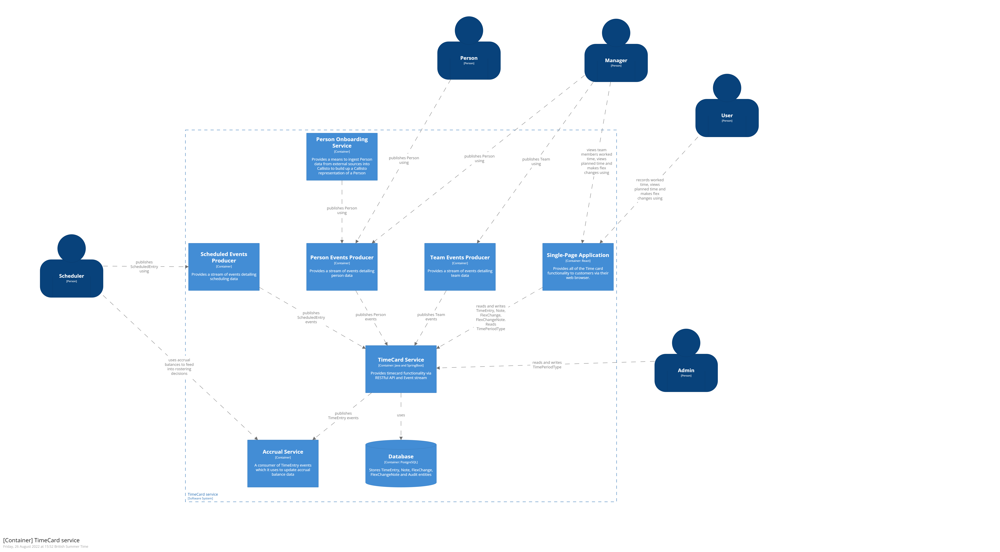

# TimeCard container

## Executive summary

The TimeCard container allows a person to record time that they have worked. This is sometimes known as booking time. It also allows that person to see what hours they have been scheduled to work. In addition, the container allows a manager to view and approve timecard entries for members of their team. Finally, the TimeCard container allow a person and their manager to make changes to scheduled time which are known as flexible (or flex) changes. 

In order to present a person with their scheduled hours, the TimeCard container consumes ScheduledActivityEvent events produced by the Scheduler Container.  

Internally the TimeCard container maintains a set of TimeEntry entities for a person which record scheduled and booked time. TimeEntry entities are collected under a single TimeCard entity for that person. TimeCard additionally holds the approval state of the TimeEntry entities that it owns. Additionally, the TimeCard container stores FlexChange entity against the TimeEntry which was impacted by the change. 

## What is the container for and why would you use it?
In the wider context of Callisto the TimeCard container is used to convey shift start/end times and dates for the given shift worker. 

A shift worker can use Timecard container to see what days and hours they have been scheduled to work on. It also allows them to record their actual hours worked against those scheduled time slots. 

A shift manager can also use the Timecard container to see who is scheduled to work in a given time period (**TODO** question - would this be something that the scheduler container provides and not the timecard container) 

A Timecard approver will also use the Timecard container to approve or reject the time that a given shift worker has recorded. 

## Dependencies

Person container – amongst other things (**TBC**) a person’s full time status determines whether or not they can take a meal break or how long their meal break can be. TimeCard needs to know a person’s full time status in order to present the Shift worker with the appropriate options when recording their meal break. 

Reference Data container – used to retrieve Activity enumeration which allows a Shift worker to record their time against an Activity 

Scheduler container – Timecard consumes ScheduledActivity events in order to create planned TimeEntry instances. Note that ScheduledActivity encapsulates absences (both planned and unplanned) and flex changes.

## Model

### Entity

**TimeEntry** 
Used to record both planned and actual time. Encapsulates day and time (to the minute). In addition, the time entry captures the way that the time has been spent via the activity property
|Field|Type|Cardinality|Description|
|--|--|--|--|
| TimePeriod | 1..1 | Enumeration |Describes how the person spent their time. Note that depending on which value is selected other data might become associated with the TimeEntry |
| Activity| 1..1 | Enumeration |This may not be required as it is detailed by Scheduler and so would be a duplication|
| StartTime| 1..1 | DateTime | The start of the time period |
| EndTime | 1..1 | DateTime | The end of the time period |
  

**Notes** 
Notes are associated with a TimeCard. Notes are used to communicate arbitrary information between individuals that relates to the TimeCard. Notes cannot exist on their own. 

|Field|Type|Cardinality|Description|
|--|--|--|--|
| Note| 1..1 | text (256)| The note itself |
| Note| 1..1 | text (256)| The note itself |

**TimeLine** 
**TODO** – confirm that this is a separate entity 

**TimeCard** 
A TimeCard instance is for a given shift worker. It collects multiple TimeEntry instances and layers on the concept of approval.  A timecard maps to a single date.

|Field|Type|Cardinality|Description|
|--|--|--|--|
| TimeCardDate| 1..1 | date| The date that this timecard represents|
| TimeCardStatus| 1..1 | Enumeration | Describes the approval status of the TimeCard |
| Approver| 0..1 | foreign key| The person who approved this time card |
| ApprovalDate| 0..1 | DateTime | When this timecard was approved |
| Person| 1..1 | foreign key |The person who has spent the time that this TimeCard encapsulates|
| TimeEntries| 0..* | set of foreign keys| Time Entries |
| Notes| 0..* | set of foreign keys| Notes |

**FlexChange** 
Encapsulates a change to one or more planned TimeEntry instances. It references TimeEntry by using the TimeEntry.id as a foreign key. There is a set of specific reasons that planned time can be changed and it must be approved. The FlexChange records this reason along with the new planned times for the associated TimeEntry instances.   

A FlexChange can be created directly by a Shift worker on their TimeCard. A FlexChange can also come from the Scheduler container 

### Enum

**TimeCardStatus** 
Describes the state that a TimeCard can be in. Covers the concept of planning time and then booking actual time. In addition, the status encapsulates TimeCard approval 

**TimeEntryActivity** 
A set of different types of work that a Shift worker can record time against 

**TimePeriod**
Describes the way a person has spent their time eg a shift, a non-working day, an absence

### Events produced

**TimeEntryEvent** 
Indicates that a new TimeEntry has been created (covers both planned or actual time) 

**FlexChangeEvent** 
Indicates that a new FlexChange has been created 

**TODO** – how to model approval 

### Events consumed

**ScheduledActivity**
Triggers the creation or update of a TimeEntry. The TimeEntry is linked to a parent TimeCard via the person id which is taken from the ScheduledActivity when creating the TimeEntry 

## Commands
### create timecard
This command causes a new TimeCard entity to be created and stored. At a minimum one TimeEntry entity must be associated with the TimeCard for the creation to be successful. If no TimeEntry is passed with the TimeCard then the command invocation should fail. Ideally the creation of a TimeEntry and a brand new TimeCard should be atomic i.e. if the TimeCard creation fails then the command invocation should fail.

#### inputs 
- TimeEntry - mandatory - the TimeEntry entity to create
- TimeCard - mandatory - the TimeCard entity to associate the TimeEntry with

#### output
 - success - see [standard command output](TODO)(**TODO**)  for how to report success output
 - business failure - see [Record Time](https://collaboration.homeoffice.gov.uk/jira/browse/EAHW-925) (access required) for business failure scenarios. Also see [standard command output](TODO) (**TODO**)  for how to report business failures
 - technical failure - see [standard command output](TODO) (**TODO**) for how to report technical failures

### add timeentry
This command causes a new TimeEntry entity to be created and associated with an existing TimeCard entity. Note that if the TimeCard does not already exist then the command invocation should fail.

#### inputs 
- TimeEntry - mandatory - the TimeEntry entity to create
- TimeCardId - mandatory - the identifier of the TimeCard entity to associate the TimeEntry with

#### output
 - success - see [standard command output](TODO)(**TODO**)  for how to report success output
 - business failure - see [Record Time](https://collaboration.homeoffice.gov.uk/jira/browse/EAHW-925) (access required) for business failure scenarios. Also see [standard command output](TODO) (**TODO**)  for how to report business failures
 - technical failure - see [standard command output](TODO) (**TODO**) for how to report technical failures
 - 
### get timecard
This command retrieves a single timecard that matches the query parameters. Note that it is possible that no timecard can be found that matches the parameters however it should not be possible for multiple timecards to match the same set of parameters.

#### inputs 
timecardDate - mandatory - the date that the timecard is associated with
timecardOwnerId  - mandatory - the person who owns the timecard
tenantId - mandatory - the tenant that holds the timecard

#### output
 - success - see [standard command output](TODO)(**TODO**)  for how to report success output
 - business failure - see [Record Time](https://collaboration.homeoffice.gov.uk/jira/browse/EAHW-925) (access required) for business failure scenarios. Also see [standard command output](TODO) (**TODO**)  for how to report business failures
 - technical failure - see [standard command output](TODO) (**TODO**) for how to report technical failures

### modify timeentry
This command causes an existing TimeEntry entity to be modifed. Note that if the TimeCard does not already exist then the command invocation should fail.

#### inputs 
- TimeEntryId - mandatory -  the identifier of the TimeEntry to modify
- TenantId    - mandatory -  the tenant that holds the timecard

#### output
 - success - see [standard command output](TODO)(**TODO**)  for how to report success output
 - business failure - see [Record Time](https://collaboration.homeoffice.gov.uk/jira/browse/EAHW-925) (access required) for business failure scenarios. Also see [standard command output](TODO) (**TODO**)  for how to report business failures
 - technical failure - see [standard command output](TODO) (**TODO**) for how to report technical failures
 
### get timecard
This command retrieves a single timecard that matches the query parameters. Note that it is possible that no timecard can be found that matches the parameters however it should not be possible for multiple timecards to match the same set of parameters.

#### inputs 
timecardDate - mandatory - the date that the timecard is associated with
timecardOwnerId  - mandatory - the person who owns the timecard
tenantId - mandatory - the tenant that holds the timecard

#### output
 - success - see [standard command output](TODO)(**TODO**)  for how to report success output
 - business failure - see [Record Time](https://collaboration.homeoffice.gov.uk/jira/browse/EAHW-925) (access required) for business failure scenarios. Also see [standard command output](TODO) (**TODO**)  for how to report business failures
 - technical failure - see [standard command output](TODO) (**TODO**) for how to report technical failures

