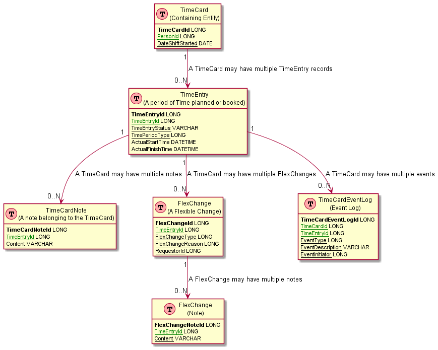

# TimeCard Data Model

## Overview

The TimeCard container needs to persist the TimeCard 'containing' entity which manages the ownership and status of the time card and the children entities including TimeEntries, TimeCardNotes and FlexChanges. In this regard the TimeCard is the covering entity and the TimeEntry is the line item.

## TO DO

 - Record OverTime
 - Record On-Call Time
 - Record Public Holiday Credits

## Entity

### TimeCard

A TimeCard instance is for a given person. It is the containing Entity for multiple TimeEntry instances as well as TimeCardNotes, FlexChanges etc.

A timecard maps to a single date but if a continuous working TimeEntry spans two dates (e.q shift started at 10pm and ended at 5am) then the date in the time card is the date the shift started.

| Key | Column Name    | Type      | Description                                                     |
| --- | -------------- | --------- | --------------------------------------------------------------- |
|     |                |           |                                                                 |
| Key | TimeCardId     | long      |                                                                 |
|     | TimeCardStatus | varchar   | Open, Locked                                                    |
|     | Date           | timestamp | Date shift started.                                             |
|     | PersonId       | long      | Person to whom the TimeCard and associated child entiies belong |
|     | LocationId     | long      | Determined by scheduler but may be amended by user              |
|     | SubmittedOn    | timestamp |                                                                 |
|     | createdtadstp  | timestamp | Created timestamp                                               |
|     | modifiedtadstp | timestamp | Last modified timestamp                                         |
|     | deleted        | bool      | Soft delete flag                                                |

### TimeEntry

TimeEntries are the line items to record the time periods end users have performed a business activity (e.g. PCP, dog handling etc) or HR activity (e.g. leaves, training etc)

TimeEntry is the actual recording of hours done by employees as per their roster.

Based on Roster pre-filled timeentry rows are created with 'Planned' state. When employee submits the time card (with or without modification) then timecard entries are changed into
'Booked'

Used to record both planned and actual time. Encapsulates day and time (to the minute). 

| Key | Column Name      | Type      | Description                   |
| --- | ---------------- | --------- | ----------------------------- |
|     |                  |           |                               |
| Key | TimeEntryId      | long      |                               |
|     | TimeCardId       | long      |                               |
|     | TimeEntryStatus  | enum      | Planned, Booked,Cancelled     |
|     | TimePeriodType   | int       | Shift, Absence, SRD, NWD, etc |
|     | ShiftType        | varchar   | Early, Late, Day etc          |
|     | ActivityId       | int       |                               |
|     | ActualStartTime  | timestamp |                               |
|     | ActualEndTime    | timestamp |                               |
|     | PlannedStartTime | timestamp |                               |
|     | PlannedEndTime   | timestamp |                               |
|     | createdtadstp    | timestamp | Created timestamp             |
|     | modifiedtadstp   | timestamp | Last modified timestamp       |
|     | deleted          | bool      | Soft delete flag              |

### TimeCardNotes

There is a requirement for AHA users to add a note to the timecard as a means of communication with the duty manager / line manager / scheduler in respect of the shift and vice versa.  
Notes are associated with a TimeCard and cannot exist on their own. 

A notes option will be available and visible for a timecard time entry. Multiple notes can be added and displayed. All saved notes will persist on the timecard timeline – notes cannot be edited or deleted. 

| Key | Column Name    | Type      | Description             |
| --- | -------------- | --------- | ----------------------- |
|     |                |           |                         |
| Key | TimeCardNoteID | long      |                         |
|     | TimeEntryId    | long      |                         |
|     | content        | varchar   |                         |
|     | createdtadstp  | timestamp | Created timestamp       |
|     | modifiedtadstp | timestamp | Last modified timestamp |
|     | deleted        | bool      | Soft delete flag        |
|     |                |           |                         |
|     |                |           |                         |

### TimeCardEventLog

All significant events which impact a TimeCard are to be logged. These events as well as fulfilling requirements for auditing will be displayed on the 'TimeLine' for a particular TimeCard giving any authorised users an easy to digest sequence of events.

| Key | Column Name      | Type      | Description                                      |
| --- | ---------------- | --------- | ------------------------------------------------ |
|     |                  |           |                                                  |
| Key | TimeCardEventLogId | long      |                                                |
|     | TimeCardId       | long      | Optional. TimeCardId to which the event belongs  |
|     | TimeEntryId      | long      | Optional. TimeEntryId to which the event belongs |
|     | EventDate        | timestamp | Event timestamp                                  |
|     | EventInitiatorId | long      | Person (if applic able) that initiated event     |
|     | EventTypeId      | long      | The type of Event.                               |
|     | EventDescription | varchar   | Textual description of the event                 |
|     | createdtadstp    | timestamp | Created timestamp                                |
|     | modifiedtadstp   | timestamp | Last modified timestamp                          |
|     | deleted          | bool      | Soft delete flag                                 |

### FlexChange

A FlexChange entry will be created for all short notice compulsory shift changes and under AHA Policy, these changes (Flexible Changes) must be authorised by a manager.  A FlexChange can be created directly by an End user Shift worker on their TimeCard entry screen or can be created by the Scheduler.

A FlexChange belongs to the containing TimeCard and may reference a TimeEntry by using the TimeEntryId.

There is a set of specific reasons that planned time can be changed and it must be The FlexChange records this reason along with the new planned times for the associated TimeEntry instances.

As they have a monetary value these should be auditable - record manager who approved flex change and who initiated on Scheduler (when available).

| Key | Column Name      | Type      | Description                                        |
| --- | ---------------- | --------- | -------------------------------------------------- |
|     |                  |           |                                                    |
| Key | FlexChangeId     | long      |                                                    |
|     | TimeEntryId      | long      | Maybe zero or blank                                |
|     | FlexChangeType   | enum      | WholesaleChange, Altered, Curtailed, ExtendedShift |
|     | EffectiveDate    | timestamp |                                                    |
|     | RequesterId      | int       | Who requested the flex change                      |
|     | ApproverId       | int       |                                                    |
|     | ApprovalDate     | timestamp |                                                    |
|     | FlexChangeReason | varchar   |                                                    |
|     | createdtadstp    | timestamp | Created timestamp                                  |
|     | modifiedtadstp   | timestamp | Last modified timestamp                            |
|     | deleted          | bool      | Soft delete flag                                   |

### FlexChangeNote

When a FlexChange is created an optional note maybe added allowing supporting information to be added. There maybe more than one not for a given FlexChange. This is independant of the Time Card note function.

| Key | Column Name      | Type      | Description             |
| --- | ---------------- | --------- | ----------------------- |
|     |                  |           |                         |
| Key | FlexChangeNoteId | long      |                         |
|     | FlexChangeId     | long      |                         |
|     |  TimeEntryId     | long      |                         |
|     | content          | varchar   |                         |
|     | createdtadstp    | timestamp | Created timestamp       |
|     | modifiedtadstp   | timestamp | Last modified timestamp |
|     | deleted          | bool      | Soft delete flag        |

### Enumerations

**TimeCardStatus** 
Describes the state that a TimeCard can be in. There is a requirement for timecard entries to be automatically locked at a defined period (e.g., 21 days). Managers can unlock. 

**ActivityId** 
A set of different types of work that an end user can record time against populated by the Scheduler. 

**TimePeriodType**
Describes the way a person has spent their time eg shift, non-working day, standard rest day, absence. This will be populated from user choosing from a configured list which can vary by location, tenant etc.

