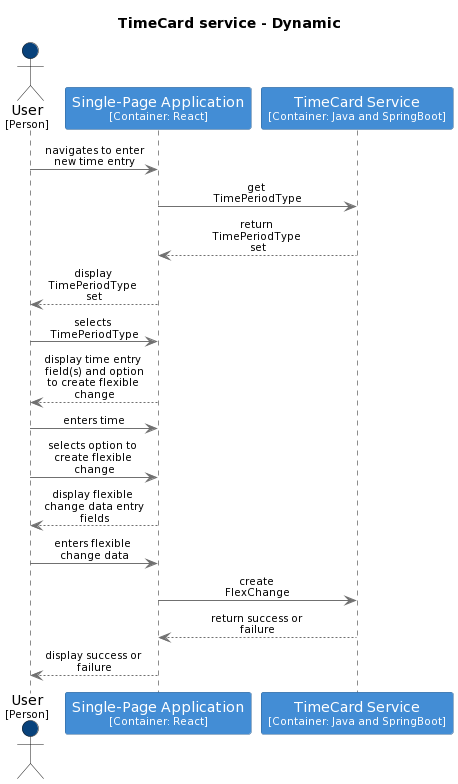

# Record Flexible Change In Timecard

This high-level design is intended to cover the Record Flexible Change In Timecard Feature. It seeks to:

1.  Guide the reader through the relevant parts of the container definitions which will be used to satisfy this feature.
2.  Where required illustrate the high-level container orchestration.
3.  Detail and explain the relevant parts of the payload model impacting this feature.

The Record Flexible Change In Timecard [feature definition](https://collaboration.homeoffice.gov.uk/jira/browse/EAHW-896) (access required) in Jira details the user stories that make up the feature. The user stories contain more detailed requirement around business rules and validation logic. The intention is that this document should be used as a guide when designing and implementing and testing against a given story from the Record Flexible Change In Timecard feature

To understand the proposed high-level design, it is instructive to consider both the definition of the [containers](./../index.md) used to perform the key actions and the appropriate parts of the [payload model](./../payload.md) specifically [FlexChange](./../payload.md#flexchange) and [TimeEntry](./../payload.md#timeentry).

## Flows

The key flows required to implement the feature tickets are described at a high level below. The sequence diagrams describe which TimeCard container commands need to be invoked and in what order so that an end user is able to record a flexible change.

Note that a FlexChange is immutable, it cannot be edited or removed. If the FlexChange is no longer relevant or was entered erroneously then the Accruals credits and adjustments functionality (at the time of writing 20 Sep 2022 the C&A requirements are not defined) will be used to reverse the effects on the owner's Accrual balance of creating the flexible change.

When an end user wants to record a flexible change the starting point will be to choose a date and search for all of the existing `TimeEntry` instances that overlap with that date (i.e. start or end on the given date).

A call to `find TimeEntry by date` will return all `TimeEntry` instances where the recorded time overlaps with the given date.

### Types of FlexChange
From there the user will modify the time recorded on the `TimeEntry`. The change they make effects the calls that a client must make. There are four distinct types of flex change that the user can make - 

 - shift **extended** by more than 30 minutes 
 - shift **altered** such that 60 minutes or more are added to the start and/or end of a shift
 - shift **curtailed** such that 120 minutes or more are removed from the end of the shift
 - shift **completely changed** such that it is moved to a different day when the `TimeEntry.owner` was not planned to be working

In all cases the action of creation a flex change requires the modification of multiple resources. In order to keep the Time Card container's data consistent the changes must be atomic such that if a change to one resource fails all related changes are rolled back or are not attempted.

### Create FlexChange

#### Extended, Altered or Curtailed

1. Having got a set of candidate `TimeEntry` instances from the Time Card container's RESTful API the user interface allows the user to select the `TimeEntry` which they want to create a `FlexChange` against.
2. The user must first modify the `TimeEntry` to update the client's in memory representation of the `TimeEntry.actualStartTime`and/or the `TimeEntry.actualEndTime` values
3. The user then selects that they wish to create a `FlexChange` and they supply the required data (see the [FlexChange](./../payload.md#flexchange) payload model)
4. The client creates an in memory `FlexChange` instance holding the flexible change data that the user supplied. In addition the `FlexChange` contains the `TimeEntry` that is to be updated
5. The user then completes the recording of the flexible change by choosing to save using the [`add FlexChange`](./../commands.md#add-flexchange) command

**Note** that the creation of a FlexChange also modifies or creates a TimeEntry. See [considerations](#considerations) for more detail.

#### Complete change
Conceptually a complete change occurs when one moves a planned shift from one day to a different day where the person was planned to be absent.

The process of creating a complete change is made up of three distinct transactions - 

1. Remove `TimeEntry` detailing absence
2. Create `FlexChange` detailing the change
3. Remove the `TimeEntry` detailing the shift that is now redundant

##### Remove `TimeEntry` detailing absence
This functionality relies on the [remove existing-timeentry](./record-time.md#remove-existing-timeentry) command

##### Create `FlexChange` detailing the change
Note that the creation of a new `TimeEntry` and an associated new `FlexChange` are both created with the call to the  [`add FlexChange`](./../commands.md#add-flexchange) command. The client must create a `FlexChange` instance which will contain the new `TimeEntry` that is to be created.

**Note** that the creation of a FlexChange also modifies or creates a TimeEntry. See [considerations](#considerations) for more detail.

##### Remove the `TimeEntry` detailing the shift that is now redundant
Finally the user can tidy up the dangling `TimeEntry` that has been now been replaced. Technically the user does not have to complete this step but failure to do so will leave TimeCard in an inconsistent state and therefore any other containers that rely on its data may also be in an inconsistent state.

This functionality relies on the [remove existing-timeentry](./record-time.md#remove-existing-timeentry) command

### Handling responses

#### find TimeEntry by date
If the response code indicates [success](https://github.com/UKHomeOffice/callisto-docs/blob/main/blueprints/restful-endpoint.md#handle-success-consistently) and the payload contains one or more `TimeEntry` instances then the client can display them and allow the
end user to choose which one to associate the new `FlexChange` with

If the response code indicates [success](https://github.com/UKHomeOffice/callisto-docs/blob/main/blueprints/restful-endpoint.md#handle-success-consistently) but the payload contains zero`TimeEntry` instances then the user is effectively trying to create a flexible change without an associated `TimeEntry`. To create a `FlexChange` a `TimeEntry` must exist.  It is up to the client about how best to inform the user that their requested action cannot be completed

#### create FlexChange
If the response code indicates [success](https://github.com/UKHomeOffice/callisto-docs/blob/main/blueprints/restful-endpoint.md#handle-success-consistently) then the user has successfully created the flexible change and it is up to the client if and how they are informed.

If the response indicates failure the client must look at the response code to determine how best to help the user resolve the issue. For example the failure might be due to a version conflict with the `TimeEntry` that is to be updated or it might be a server issue in which case there is little the user can do.  Again, as with success response it it up to the client as to how it informs the user.

### Handling version conflicts
When updating a `TimeEntry` care must be taken to avoid overwriting changes. See [considerations](https://github.com/UKHomeOffice/callisto-timecard-restapi/blob/main/docs/features/record-time.md#considerations) See [RESTful endpoint blueprint](https://github.com/UKHomeOffice/callisto-docs/blob/main/blueprints/restful-endpoint.md#managing-resource-contention) for guidance on dealing with locking in a RESTful context for more details.

### Container commands
- [TimeCard.find TimeEntry by date(timeentryDate, ownerId, tenantId)](../commands.md#get-timeentry-by-date) - used to retrieve `TimeEntry` instances. 
- [TimeCard.add flexchange(flexChange, tenantId)](../commands.md#add-flexchange) - used to create a new `FlexChange`
- [TimeCard.getTimePeriodType(tenantId, personId)](../commands.md#get-timeperiodtype) - retrieves list of TimePeriodTypes and ValueType
- [TimeCard.remove timeentry(timeEntry, tenantId)](../commands.md#remove-timeentry) - used to remove an existing `TimeEntry`

## Payload model

This section describes which parts of the TimeCard container's payload model are relevant when an end user wants to record their time. More information can be found in the [payload model definition](./../payload.md). The key resource for the record time feature is the [FlexChange](./../payload.md#flexchange).

## Considerations

1. The persistence of a FlexChange touches multiple entities in the TimeCard container's data store. The changes must be atomic
2. The `add FlexChange` command does two things - it creates a `FlexChange` and it creates or modifies a `TimeEntry`. When this command gets implemented as a RESTful endpoint it may not belong under the resources/ path. This command is more of an process command as opposed to a resource command. More reading on this topic here - [Process driven REST API design](https://hackernoon.com/process-driven-rest-api-design-75ca88917582)

## Out of scope

### Business rules
It is anticipated that business rule validation they will be dealt with at the component level

### Events
There will be a number of events that should be generated as part of recoding a flex change. Note that at the time of writing (14 Sep 2022) more work is required to define what triggers these events are and what they contain. It is likely that they will not be elaborated until they are consumed as part of other features

### Authorisation
AuthN/AuthZ forms part of a wider design that will be covered separately          |

