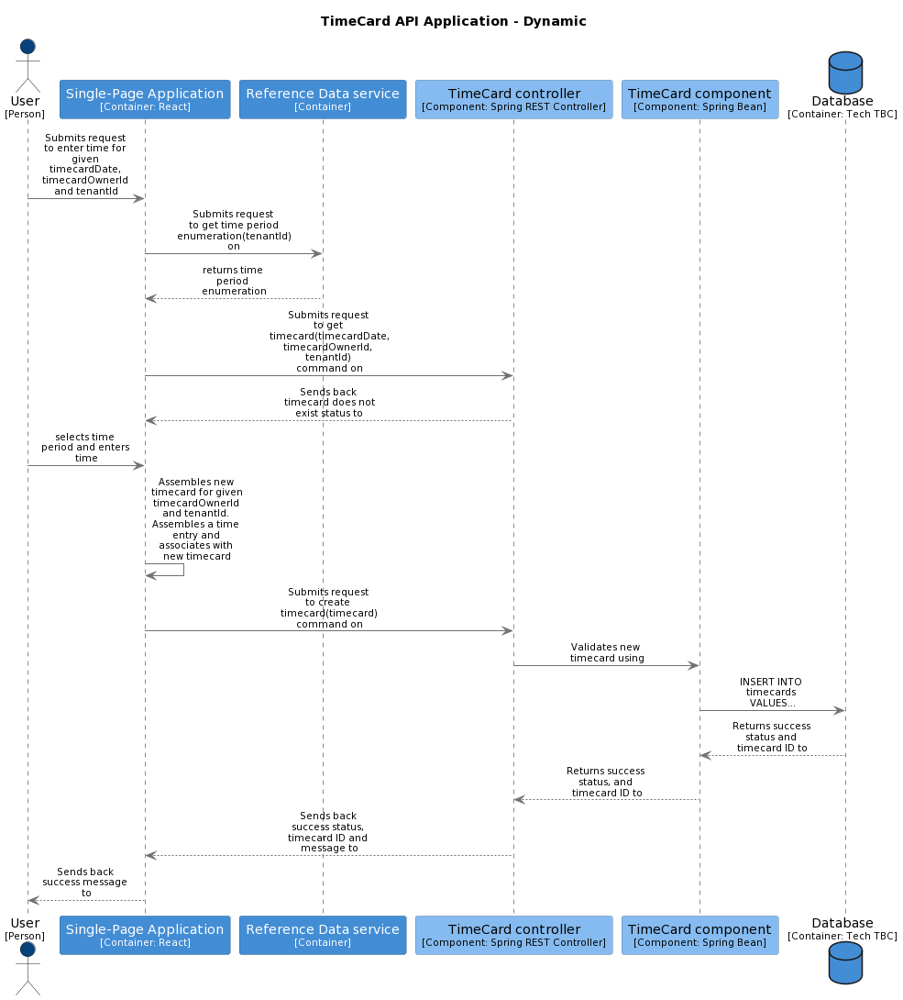
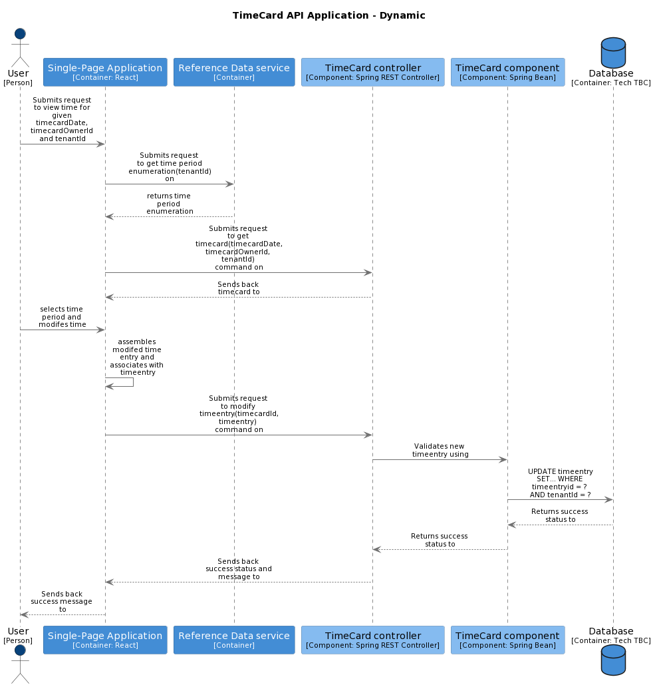

# Record time

[Feature defintion](https://collaboration.homeoffice.gov.uk/jira/browse/EAHW-925) (access required)

## Data Flows
The following data flows underpin the user stories that sit under the Record time feature. 

### View non-existing timecard

**user stories** 

- [Timecard View - No Shift / Day Type Populated](https://collaboration.homeoffice.gov.uk/jira/browse/EAHW-1230) (access required)

**input(s)** 

- timecardDate - the date that the timecard is associated with
- timecardOwnerId - the primary key of the person who is the owner of the timecard
- tenantId - the identifier for the tenant that holds the timecard 

**container commands**
- ReferenceData.get time period enumeration(tenantId) - used to give the user a choice as to what type of time period they wish to enter
- [TimeCard.get timecard(timecardDate, timecardOwnerId, tenantId)](../container-definition.md#get-timecard) - used to retrieve a timecard. Note that in this data flow the expectation is that this call will return a timecard now found status
- [TimeCard.create timecard(TimeCardEntitiy)](../container-definition.md#create-timecard) - used to create a brand new TimeCard entity along with a new TimeEntry entitiy that is in part populated from the time period value that the user has chosen and the subsequent time or date values that they have entered

**sequence diagrams**

### create time entry

**user stories** 

- [Manager Input Start and Finish Time (No Existing Entries)](https://collaboration.homeoffice.gov.uk/jira/browse/EAHW-1751) (access required)
- [Manager Add On-call Period to Timecard (Existing Non On-Call Entry)](https://collaboration.homeoffice.gov.uk/jira/browse/EAHW-1788) (access required)
- [Add On-call Period to Timecard (Existing On-Call Entry) - Validation Fail](https://collaboration.homeoffice.gov.uk/jira/browse/EAHW-1762) (access required)
- [Add Time Worked During On-call Period to Timecard](https://collaboration.homeoffice.gov.uk/jira/browse/EAHW-1796) (access required)
- [Input Finish Time - Day After Start Time Date (No Existing End Time)](https://collaboration.homeoffice.gov.uk/jira/browse/EAHW-589) (access required)
- [Input Start Time (No Existing Entries)](https://collaboration.homeoffice.gov.uk/jira/browse/EAHW-513) (access required)
- [Input Finish Time Same Day (No Existing Finish Time)](https://collaboration.homeoffice.gov.uk/jira/browse/EAHW-521) (access required)
- [Record Shift in Timecard (No Existing Entries)](https://collaboration.homeoffice.gov.uk/jira/browse/EAHW-1347) (access required)
- [Record On-call Period in Timecard (Blank Timecard)](https://collaboration.homeoffice.gov.uk/jira/browse/EAHW-1350) (access required)
- [Input Start and Finish Time (No Existing Entries)](https://collaboration.homeoffice.gov.uk/jira/browse/EAHW-1402) (access required)
- [Add On-call Period to Timecard (Existing Non On-Call Entry)](https://collaboration.homeoffice.gov.uk/jira/browse/EAHW-1471) (access required)
- [Add On-call Period to Timecard (Existing On-Call Entry)](https://collaboration.homeoffice.gov.uk/jira/browse/EAHW-1761) (access required)
- [User Record an Ends night shift then starts a night shift in same day - System will identify them as separate shifts.](https://collaboration.homeoffice.gov.uk/jira/browse/EAHW-580) (access required)
- [Manager Record On-Call Period in Timecard (Blank Timecard)](https://collaboration.homeoffice.gov.uk/jira/browse/EAHW-1685) (access required)
- [Manager Record Shift in Timecard (No Existing Entries)](https://collaboration.homeoffice.gov.uk/jira/browse/EAHW-1686) (access required)
- [Manager Input Finish Time Same Day (No Existing Finish Time)](https://collaboration.homeoffice.gov.uk/jira/browse/EAHW-1749) (access required)

**inputs** 

**container commands** 

**sequence diagrams** 

### remove time entry

**user stories** 
- [Remove Timecard Time Period (Existing Entry)](https://collaboration.homeoffice.gov.uk/jira/browse/EAHW-1353) (access required)
- [Manager Remove Timecard Time Period (Existing Entry)](https://collaboration.homeoffice.gov.uk/jira/browse/EAHW-1869) (access required)

**inputs** 

**container commands** 

**sequence diagrams** 

### modify time entry

**user stories** 
- [User Can Edit Time Periods in their Timecard](https://collaboration.homeoffice.gov.uk/jira/browse/EAHW-864) (access required)
- [Edit Finish Time in Timecard for Same Day - Change Indicator Visible](https://collaboration.homeoffice.gov.uk/jira/browse/EAHW-1728) (access required)
- [Edit Start Time in Timecard for Same Day - Change Indicator Visible](https://collaboration.homeoffice.gov.uk/jira/browse/EAHW-1729) (access required)
- [Edit Finish Time - Day After Start Time Date](https://collaboration.homeoffice.gov.uk/jira/browse/EAHW-1724) (access required)
- [Edit Start Time in Timecard for Same Day](https://collaboration.homeoffice.gov.uk/jira/browse/EAHW-609) (access required)
- [Edit Finish Time in Timecard for Same Day](https://collaboration.homeoffice.gov.uk/jira/browse/EAHW-1320) (access required)
- [Edit Finish Time - 24Hrs+ after start time date](https://collaboration.homeoffice.gov.uk/jira/browse/EAHW-590) (access required)
- [Edit Finish Time in Timecard for Same Day - Manager](https://collaboration.homeoffice.gov.uk/jira/browse/EAHW-1678) (access required)
- [Manager Edit Start Time in Timecard for Same Day](https://collaboration.homeoffice.gov.uk/jira/browse/EAHW-1753) (access required)

**inputs** 

- timecardDate - the date that the timecard is associated with
- timecardOwnerId - the primary key of the person who is the owner of the timecard
- tenantId - the identifier for the tenant that holds the timecard 

**container commands** 

- [TimeCard.get timecard(timecardDate, timecardOwnerId, tenantId)](../container-definition.md#get-timecard) - used to retrieve a timecard. Note that in this data flow the expectation is that this call will return a timecard now found status
- [TimeCard.modify timecard(TimeCardEntitiy)](../container-definition.md#create-timecard) - used to modify an existing TimeEntry entity belonging to an existing TimeCard entitiy that is in part populated from the modified time or date values that they have entered

**sequence diagrams** 

### create date entry

**user stories** 

- [Record SRD in Timecard (No Existing Entries)](https://collaboration.homeoffice.gov.uk/jira/browse/EAHW-1348) (access required)
- [Record NWD in Timecard (No Existing Entries)](https://collaboration.homeoffice.gov.uk/jira/browse/EAHW-1349) (access required)
- [Manager Record SRD in Timecard (No Existing Entries)](https://collaboration.homeoffice.gov.uk/jira/browse/EAHW-1683) (access required)
- [Manager Record NWD in Timecard (No Existing Entries)](https://collaboration.homeoffice.gov.uk/jira/browse/EAHW-1684) (access required)

**inputs** 

**container commands** 

**sequence diagrams** 

### remove date entry

**user stories** 
- [Remove Timecard Time Period (Existing Entry)](https://collaboration.homeoffice.gov.uk/jira/browse/EAHW-1353) (access required)
- [Manager Remove Timecard Time Period (Existing Entry)](https://collaboration.homeoffice.gov.uk/jira/browse/EAHW-1869) (access required)

**inputs** 

**container commands** 

**sequence diagrams** 
