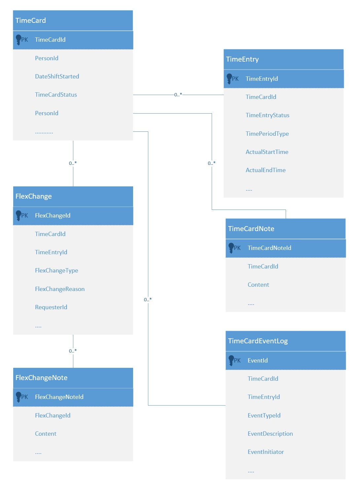

# Record time

This high-level design is intended to cover the Record Time Feature which includes the user stories listed below. It seeks to:

1.  Guide the reader through the relevant parts of the container definitions which will be used to satisfy this feature.
2.  Where required illustrate the high-level container orchestration.
3.  Detail and explain the relevant parts of the data model impacting this feature.

**WW - added a bit more context**
The Record Time [feature definition](https://collaboration.homeoffice.gov.uk/jira/browse/EAHW-925) (access required) in Jira details the user stories that make up the feature. The user stories contain more detailed requirement around business rules and validation logic. The intention is that this document should be used as a guide when designing and implementing and testing against a given story from the record time feature

**WW - removed user stories as already found in the feature definition**

## Overview

**WW - reworded to make links out flow with the narrative**
To understand the proposed high-level design, it is instructive to consider both the definition of the [containers](../../container-definition.md) used to perform TimeCard actions and the appropriate parts of the [data model](../../datamodel-definition.md) specifically [TimeCard](../../datamodel-definition.md#timecard) and [TimeEntry](../../datamodel-definition.md#timeentry).

### Key data models

**WW - added new section with an explicit header**
This section describes which parts of the TimeCard data model are relevent when an end user wants to record their time.
- A TimeCard instance is for a given person. It is the containing Entity for multiple TimeEntry instances as well as TimeCardNotes, FlexChanges as shown below. 
- A TimeEntry belongs to a TimeCard with an identical TimeCardId. When creating a TimeEntry it must be associated with a TimeCard, it cannot exist on its own.

Note that a TimeCard maps to a single date but if a continuous working TimeEntry spans two dates (e.q shift started at 10pm and ended at 5am) then the date in the TimeCard is the date the shift started.

### Key command sequences
**WW - removed Get TimeCard and renamed to be more explicit about intention of this section**
This section describes which commands need to be invoked and in what order so that an end user is able to record their time or remove any previously recorded time.

**WW - reworded**
#### Get the TimeCard for a given date
When an end user wants to record a time entry the starting point will be to choose a date and check whether there is a TimeCard already created for that date. If a TimeCard does exist then the returned payload will contain, amongst other things any TimeEntry records that were previously created and associated with the TimeCard

So a call to get timecard will return the entire TimeCard instance including TimeEntry records, FlexChanges, TimeCardNotes and TimeCardEvents for display.

**WW - removed inputs and outputs as they are documented on the command definition**

#### container command(s)
- [TimeCard.get timecard(timecardDate, timecardOwnerId, tenantId)](../../container-definition.md#get-timecard) - used to retrieve a timecard. 

### Record time
**WW - reworked to link out to standard approach to response codes and added links to relevent container commands**
The user wants to record time. Once the response has been returned from the call to get a TimeCard the client has a choice to make depending upon whether or not the TimeCard was found.

#### TimeCard found
 If the response code indicates [success](https://github.com/UKHomeOffice/callisto-docs/blob/main/blueprints/restful-endpoint.md#handle-success-consistently) and the payload contains a TimeCard then the client can display it and allow the
end user to choose to modify an existing TimeEntry or add a new TimeEntry
**WW - changed the "modify an existing TimeCard" to "modify an existing TimeEntry"**

#### container command(s)
- [TimeCard.modify timeentry(timeEntry, tenantId)](../../container-definition.md#modify-timeentry) - used to modify an existing TimeEntry 
- [TimeCard.add timeentry(timecardId, timeEntry, tenantId)](../../container-definition.md#add-timeentry) - used to add a new TimeEntry

#### TimeCard not found
If the response code indicates that the TimeCard resource was [not found](https://github.com/UKHomeOffice/callisto-docs/blob/main/blueprints/restful-endpoint.md#handle-errors-gracefully-and-return-standard-error-codes) then effectively the end user is creating the first TimeEntry for a given date. In this scenario two entities will
be created as follows:

- TimeCard -- containing entity
- TimeEntry -- detailing the time period to be recorded
**WW - removed TimeCardEventLog as I feel more thought is needed**

#### container command(s)
- [TimeCard.create_timecard(timeCard, tenantId)](../../container-definition.md#create-timecard) - used to create a new TimeCard. Note that it must have at least one TimeEntry 

When a timecard for that date already exists the addition of a new timecard entry will trigger an update to that existing timecard and its component parts. **WW - suggest removing this paragraph as I don't think it adds any new info**

### Modify TimeEntry
**WW - suggest removing this section as it's covered above**
- [Update TimeCard](../../container-definition.md#update-timecard) - used to update an existing timecard. 

### Remove time
**WW - Reworded**
The user wants to remove previously recorded time. Once the response has been returned from the call to get a TimeCard the client has a choice to make depending upon whether or not the TimeCard was found.

#### TimeCard found
 If the response code indicates [success](https://github.com/UKHomeOffice/callisto-docs/blob/main/blueprints/restful-endpoint.md#handle-success-consistently) and the payload contains a TimeCard then the client can display it and allow the end user to choose to remove one or more existing TimeEntry instances

#### container command(s)
- [Remove TimeEntry](../../container-definition.md#remove-timeentry) - used to remove an existing timeentry within an exisiting TimeCard. It will not delete the TimeCard

#### TimeCard not found
If the response code indicates that the TimeCard resource was [not found](https://github.com/UKHomeOffice/callisto-docs/blob/main/blueprints/restful-endpoint.md#handle-errors-gracefully-and-return-standard-error-codes) then effectively the end user is trying to delete something that does not exist therefore it is up to the client about how best to inform the user that their requested action cannot be completed

#### container command(s)
- None

## Considerations

1.  Locking. Whilst the TimeCard and its component parts are being viewed none of the records are locked. Therefore it is important that the client returns are token of some kind that would allow the service to check that the database record matches the one being updated. The modifiedtadstp is suggested **WW - needs to be consistent with blueprint**. See [blueprint](https://github.com/UKHomeOffice/callisto-docs/blob/main/blueprints/restful-endpoint.md#managing-resource-contention) on dealing with locking in a RESTful context for more details
2.  The type of information collected to record a time entry varies according to the TimePeriodType (Shift, Standard Rest Day etc) selected by the user. For example for a SRD only a date is required but for a shift a start time and end time is collected. **WW - this needs more thought - we should add direction in this document for how to go about presenting this to the end user**

