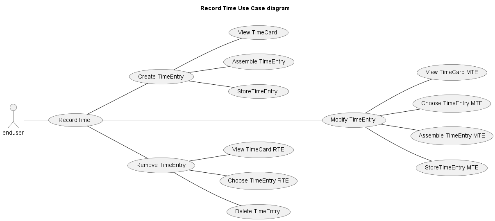
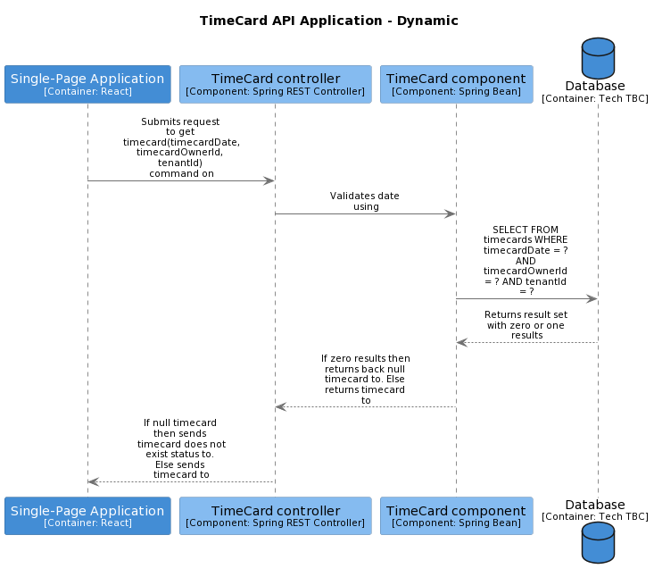
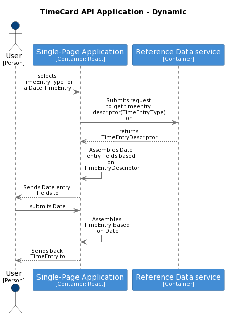

# Record time

[Feature definition](https://collaboration.homeoffice.gov.uk/jira/browse/EAHW-925) (access required)

## Use Cases

### Create TimeEntry
A timecard entry must be associated with a timecard, it cannot exist on its own. The association is made by the start date on the timecard entry matching the date on the timecard.

It is possible to create a timecard entry and as a side-effect trigger the creation of the containing timecard if one does not already exist. 

Alternatively the timecard may already exist in which case the addition of a new timecard entry will trigger an update to that existing timecard.

#### user stories

- [Manager Input Start and Finish Time (No Existing Entries)](https://collaboration.homeoffice.gov.uk/jira/browse/EAHW-1751) (access required)
- [Manager Add On-call Period to Timecard (Existing Non On-Call Entry)](https://collaboration.homeoffice.gov.uk/jira/browse/EAHW-1788) (access required)
- [Add On-call Period to Timecard (Existing On-Call Entry) - Validation Fail](https://collaboration.homeoffice.gov.uk/jira/browse/EAHW-1762) (access required)
- [Add Time Worked During On-call Period to Timecard](https://collaboration.homeoffice.gov.uk/jira/browse/EAHW-1796) (access required)
- [Input Finish Time - Day After Start Time Date (No Existing End Time)](https://collaboration.homeoffice.gov.uk/jira/browse/EAHW-589) (access required)
- [Input Start Time (No Existing Entries)](https://collaboration.homeoffice.gov.uk/jira/browse/EAHW-513) (access required)
- [Input Finish Time Same Day (No Existing Finish Time)](https://collaboration.homeoffice.gov.uk/jira/browse/EAHW-521) (access required)
- [Record Shift in Timecard (No Existing Entries)](https://collaboration.homeoffice.gov.uk/jira/browse/EAHW-1347) (access required)
- [Record On-call Period in Timecard (Blank Timecard)](https://collaboration.homeoffice.gov.uk/jira/browse/EAHW-1350) (access required)
- [Input Start and Finish Time (No Existing Entries)](https://collaboration.homeoffice.gov.uk/jira/browse/EAHW-1402) (access required)
- [Add On-call Period to Timecard (Existing Non On-Call Entry)](https://collaboration.homeoffice.gov.uk/jira/browse/EAHW-1471) (access required)
- [Add On-call Period to Timecard (Existing On-Call Entry)](https://collaboration.homeoffice.gov.uk/jira/browse/EAHW-1761) (access required)
- [User Record an Ends night shift then starts a night shift in same day - System will identify them as separate shifts.](https://collaboration.homeoffice.gov.uk/jira/browse/EAHW-580) (access required)
- [Manager Record On-Call Period in Timecard (Blank Timecard)](https://collaboration.homeoffice.gov.uk/jira/browse/EAHW-1685) (access required)
- [Manager Record Shift in Timecard (No Existing Entries)](https://collaboration.homeoffice.gov.uk/jira/browse/EAHW-1686) (access required)
- [Manager Input Finish Time Same Day (No Existing Finish Time)](https://collaboration.homeoffice.gov.uk/jira/browse/EAHW-1749) (access required)

#### flow
The starting point is [View TimeCard](#view-timecard). The user wishes to create a TimeEntry and that must be associated with a TimeCard. 

If one does not exist then it must be created as part of the process for creating the TimeEntry. 

If one does exist then the new TimeEntry will be associated with that existing TimeCard

`if TimeCard exists then`
- [Assemble TimeEntry - Enter Time](#assemble-timeentry---enter-time) OR [Assemble TimeEntry - Enter Date](#assemble-timeentry---enter-date) - Depending upon the type of TimeEntry that the user wishes to create the type of data that they enter will vary.
- [Store TimeEntry](#store-timeentry) - Once the TimeEntry has been created and initialised it needs to be persisted along with its association to the given TimeCard

`else`
- [Assemble TimeEntry - Enter Time](#assemble-timeentry-enter-time) OR [Assemble TimeEntry - Enter Date](#assemble-timeentry-enter-date) - Depending upon the type of TimeEntry that the user wishes to create the type of data that they enter will vary.
- [Assemble TimeCard](#assemble-timecard) - creates an empty skeletal TimeCard and adds the TimeEntry created in the previous step. This is crucial as a new TimeCard is only valid if it has at least one TimeEntry
- [Store TimeCard](#store-timecard) - Once the TimeCard has been created and initialised it needs to be persisted along. This will also persist the associated TimeEntry in the same transaction

### Modify TimeEntry

### Remove TimeEntry

## Functions

### View Timecard

#### input(s)
- timecardDate - mandatory - the date that the timecard is associated with
- timecardOwnerId - mandatory - the primary key of the person who is the owner of the timecard
- tenantId - mandatory the identifier for the tenant that holds the timecard 

#### output(s)
TimeCard or a TimeCard does not exist status message 

#### container command(s)
- [TimeCard.get timecard(timecardDate, timecardOwnerId, tenantId)](../../container-definition.md#get-timecard) - used to retrieve a timecard. Note that in this data flow the expectation is that this call will return a timecard now found status

### Assemble TimeEntry - Enter Time

#### input(s)
- timeEntryType - the type of TimeEntry that the user wants to create
- startDateTime - the date and time that the time entry starts at
- endDateTime - the date and time that the time entry ends at

#### output(s)
#### container command(s)
- ReferenceData.get timeentry descriptor(TimeEntryType) - used get a desciption of the data to capture when creating a TimeEntry instance corresponding to the given TimeEntryType

### Assemble TimeEntry - Enter Date

#### input(s)
- timeEntryType - the type of TimeEntry that the user wants to create
- date- the date that the TimeEntry covers

#### output(s)
#### container command(s)
- ReferenceData.get timeentry descriptor(TimeEntryType) - used get a desciption of the data to capture when creating a TimeEntry instance corresponding to the given TimeEntryType

### Store TimeEntry
TODO
#### input(s)
#### output(s)
#### container command(s)

### Assemble TimeCard
TODO
#### input(s)
#### output(s)
#### container command(s)

### Store TimeCard
TODO
#### input(s)
#### output(s)
#### container command(s)

