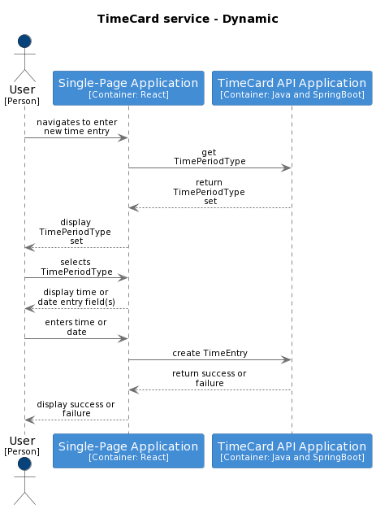
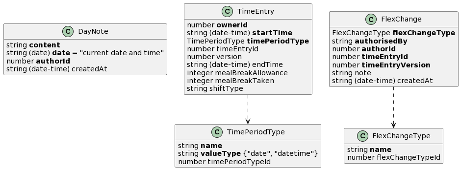

# Record time

This high-level design is intended to cover the Record Time Feature which includes the user stories listed below. It seeks to:

1.  Guide the reader through the relevant parts of the container definitions which will be used to satisfy this feature.
2.  Where required illustrate the high-level container orchestration.
3.  Detail and explain the relevant parts of the data model impacting this feature.

The Record Time [feature definition](https://collaboration.homeoffice.gov.uk/jira/browse/EAHW-925) (access required) in Jira details the user stories that make up the feature. The user stories contain more detailed requirement around business rules and validation logic. The intention is that this document should be used as a guide when designing and implementing and testing against a given story from the record time feature

To understand the proposed high-level design, it is instructive to consider both the definition of the [containers](../../index.md) used to perform the key actions and the appropriate parts of the [payload model](../../payload.md) specifically [TimeEntry](../../payload.md#timeentry).

## Flows

The key flows required to implement the feature tickets are described at a high level below. The sequence diagrams describe which TimeCard container commands need to be invoked and in what order so that an end user is able to record their time or remove any previously recorded time.

There are three top level flows that make up record time - 

- Create a new TimeEntry
- Modifiy an existing TimeEntry
- Remove an existing TimeEntry

When an end user wants to record time worked then the starting point will be to choose a date and check whether there are any existing `TimeEntry` instances that should be updated to record the time that the user wants to enter.

A call to `find TimeEntry by date` will return all `TimeEntry` instances where the recorded time overlaps with the given date.

### Handling responses
If the response code indicates [success](https://github.com/UKHomeOffice/callisto-docs/blob/main/blueprints/restful-endpoint.md#handle-success-consistently) and the payload contains one or more `TimeEntry` instances then the client can display them and allow the
end user to choose to modify an existing `TimeEntry` or create a new `TimeEntry`

If the response code indicates that `TimeEntry` resources were [not found](https://github.com/UKHomeOffice/callisto-docs/blob/main/blueprints/restful-endpoint.md#handle-errors-gracefully-and-return-standard-error-codes) then effectively the end user is trying to delete something that does not exist therefore it is up to the client about how best to inform the user that their requested action cannot be completed

### Handling version conflicts
When updating a `TimeEntry` (modify or remove) care must be taken to avoid overwritting changes. See [considerations](#considerations) for more detail on dealing with version conflicts

### Date or Time entry
The `timePeriodType` property on a [`TimeEntry`](../../payload.md#time-entry) governs howe granular the time entered by the user needs to be. Some kinds of `TimePeriodType` require the user to enter a period explicity down to the date, hour and minute. Others only require the user to enter a single date. On this basis the client must be capable of using the TimeEntryPeriod to determine what data entry fields to present the user with and then hook up the value(s) entered by the user to a `TimeEntry` instance. More information can be found in [considerations](#considerations).

### Create new Timeentry

#### Container commands
- [TimeCard.find TimeEntry by date(timeentryDate, timeentryOwnerId, tenantId)](../../commands.md#get-timeentry-by-date) - used to retrieve `TimeEntry` instances. 
- [TimeCard.create timeentry(timeEntry, tenantId)](../../commands.md#create-timeentry) - used to create a new `TimeEntry`
- TimeCard.get all TimeEntryType and Config - TBC

### Modify existing Timeentry

#### Container commands
- [TimeCard.find TimeEntry by date(timeentryDate, timeentryOwnerId, tenantId)](../../commands.md#get-timeentry-by-date) - used to retrieve `TimeEntry` instances. 
- [TimeCard.modify timeentry(timeEntry, tenantId)](../../commands.md#modify-timeentry) - used to modify an existing `TimeEntry`
- TimeCard.get Config - TBC

### Remove existing Timeentry

#### Container commands
- [TimeCard.find TimeEntry by date(timeentryDate, timeentryOwnerId, tenantId)](../../commands.md#get-timeentry-by-date) - used to retrieve `TimeEntry` instances. 
- [TimeCard.remove timeentry(timeEntry, tenantId)](../../commands.md#remove-timeentry) - used to remove an existing `TimeEntry`

## Key data models

### Payload model

This section describes which parts of the TimeCard container's payload model are relevant when an end user wants to record their time. More information can be found in the [payload model definition](../../payload.md). The key resource for the record time feature is the [TimeEntry](../../payload.md#timeentry).

### Storage model
This section describes how the TimeCard container should store its data. More information can be found in the [storage model definition](../../storage.md)

## Considerations

1. Versioning - When updating the TimeCard container's data the system must prevent unintentional overwrites sometimes known as a [lost update](https://www.w3.org/1999/04/Editing/#3.1).  See [RESTful endpoint blueprint](https://github.com/UKHomeOffice/callisto-docs/blob/main/blueprints/restful-endpoint.md#managing-resource-contention) for guidance on dealing with locking in a RESTful context for more details. 
2. Unique ID + tenant ID - **TODO** write up composite key decision and link to it
3. Person data - both the `TimeEntry` and `Note` resources contain a Person identifier which is assigned by the Person container. In order to access any TimeCard container functionality a user must be logged in. It is assumed that the client has the logged in user's Person identifier in scope. Therefore when creating a `TimeEntry` or a `Note` the client is able to populate the ownerId and authorId fields respectively using the in scope Person identifier
4. Reference data - There are a number of pieces of reference data that are used in the recording of time. Note that at the time of writing (02 Aug 2022) more work is required to define how reference data is maintained and accessed
5. `TimePeriodType` - the choice of` TimePeriodType` in turn drives what data the user needs to provide in order to create a `TimeEntry`. For example with a Standard Rest Day (SRD) the user need only provide the date however with a shift the user needs to provide both a start and end time. The client should be able to present the user with a means of them entering the minimum required data. Ultimately the client is responsible for populating the `TimeEntry` `actualStartTime` and `actualEndTime` fields but might only collect a date from the user and translate that into a start and end time when populating the `TimeEntry`

## Out of scope
It is ancitpated that *business rule* validation they will be dealt with at the component level

Additionally, the following user stories though documented in the record time feature in Jira will not be considered in this design

| user story | solution design |
|------------|-----------------|
| [Audit - Edit Start Time in Timecard for Same Day](https://collaboration.homeoffice.gov.uk/jira/browse/EAHW-1754)           |    [audit - timecard](../audit-timecard/index.md)             |
| [Audit - Record NWD in Timecard (No Existing Entries)](https://collaboration.homeoffice.gov.uk/jira/browse/EAHW-1892)           |    [audit - timecard](../audit-timecard/index.md)             |
| [Update Timeline - Input Finish Time Same Day (No Existing Finish Time)](https://collaboration.homeoffice.gov.uk/jira/browse/EAHW-1750)           |    [timecard - timeline](../timecard-timeline/index.md)             |
| [Update Timeline - Edit Start Time in Timecard for Same Day](https://collaboration.homeoffice.gov.uk/jira/browse/EAHW-1755)           |    [timecard - timeline](../timecard-timeline/index.md)             |

## TODO
The following functionality has not yet been designed

- Audit
- TimeLine
- Authorisation (manager and user access)
- Events - There will be a number of events that should be generated as part of recoding time. Note that at the time of writing (02 Aug 2022) more work is required to define what triggers these events are and what they contain. It is likely that they will not be elaborated until they are consumed as part of other features
